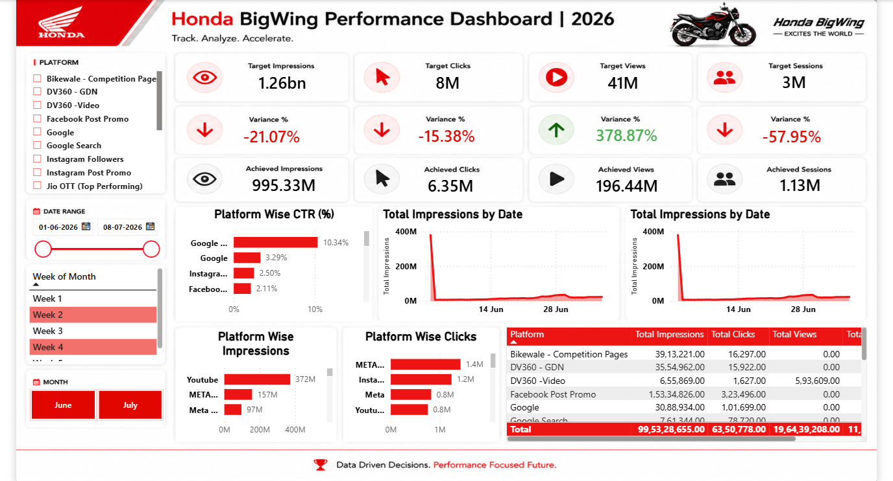

# Honda BigWing Performance Dashboard | 2026

> **Track. Analyze. Accelerate.**
> An interactive Power BI dashboard that tracks digital marketing performance of Honda BigWing campaigns against targets across platforms.



> **Disclaimer:** This is an independent portfolio project. It is not affiliated with or endorsed by Honda. Honda and BigWing names and logos belong to their respective owners. [Data is sample / anonymized — edit this line as applicable.]

---

## Project Overview

Marketing teams run campaigns across many platforms (Google, Meta, YouTube, Jio OTT, etc.), but it is hard to see at a glance **which platform is delivering and which is falling short of its target**.

This dashboard brings all campaign metrics into one view and compares **Target vs Achieved** for four core KPIs: Impressions, Clicks, Views and Sessions.

**Reporting period:** 01 Jun 2026 to 08 Jul 2026

---

## Key Metrics Tracked

| KPI | Target | Achieved | Variance |
|---|---|---|---|
| Impressions | 1.26bn | 995.33M | -21.07% |
| Clicks | 8M | 6.35M | -15.38% |
| Views | 41M | 196.44M | +378.87% |
| Sessions | 3M | 1.13M | -57.95% |

---

## Key Insights

- **Impressions and clicks fell short of target** by about 21% and 15%, so reach and engagement were both below plan.
- **Video views massively overdelivered** (almost 5x the target), which suggests the video targets may have been set too low, or video creatives performed exceptionally well.
- **Sessions are the weakest KPI (-58%)**: people are viewing and clicking, but not enough of them are landing on the site. This points to a gap between ad engagement and landing experience.
- **Google leads on CTR (10.34%)**, well ahead of Instagram (2.50%) and Facebook (2.11%).
- **YouTube drives the most impressions (372M)**, while **Meta platforms drive the most clicks (about 1.4M)**.

---

## Dashboard Features

- Slicers: Platform, Date Range, Week of Month, Month
- KPI cards: Target, Achieved and Variance % (color-coded green/red)
- Platform-wise CTR, Impressions and Clicks bar charts
- Total Impressions by Date trend
- Detailed platform table with Impressions, Clicks and Views and a grand total

---

## Tools and Technologies

- **Power BI Desktop**
- **DAX** for measures and variance calculations
- **Power Query** for data cleaning and transformation [confirm]
- [Excel / CSV / SQL: add your data source]

---

## Data Model

Tables: `Data`, `DateTable`, `Target`


[Describe relationships, e.g. DateTable[Date] -> Data[Date] (one-to-many)]

---

## Key DAX Measures

```DAX
-- Paste your real measures here. Example structure:

Achieved Impressions = SUM(Data[Impressions])

Target Impressions = SUM(Target[Impressions])

Variance % =
DIVIDE([Achieved Impressions] - [Target Impressions], [Target Impressions])

CTR % = DIVIDE(SUM(Data[Clicks]), SUM(Data[Impressions]))
```

---

## Repository Structure

```
Honda-BigWing-Dashboard/
├── Honda_BigWing_Dashboard.pbix
├── README.md
└── screenshots/
    ├── page-1.png
    ├── page-2.png
    ├── page-3.png
    └── data-model.png
```

---

## How to Use

1. Download `Honda_BigWing_Dashboard.pbix`
2. Open it in **Power BI Desktop**
3. Use the slicers to filter by platform, date and month

---

## Author

**Shivam Gupta**
- LinkedIn: [linkedin.com/in/shivam-gupta-6b72b5238](https://linkedin.com/in/shivam-gupta-6b72b5238)
- GitHub: [github.com/Shivamgupta6388](https://github.com/Shivamgupta6388)

*If you found this useful, give the repo a star!*
